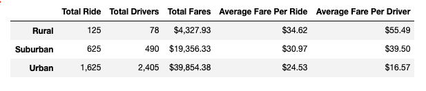
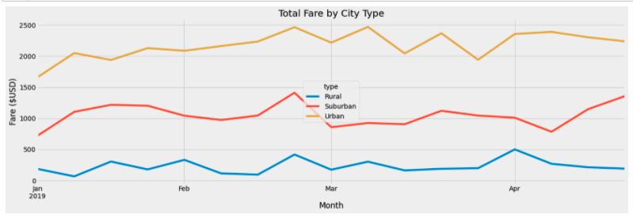

# Pyber Analysis

### Overview of Analysis 

Perform exploratory analysis on large data CSV files and create several visualization aids to better help explain the data. I used these charts to visualize the relationship between the type of city and the number of riders and drivers as well as their percentages. The data will help determine affordability for underserved neighborhoods.

### Results 

  - Rural cities have the lowest total rides but the highest average fare per ride ($34.62) and highest average fare per driver ($55.49).
  
  - Suburban cities have far less drivers (625) than urban cities (2405) do yet their average fare is about 26% higher.
  
  - Urban cities average more than 2 times the number of rides than rural and suburban cities combined, more than 4 times the number of drivers, but their     average fares are about 26% less than suburban and about 40% less than rural cities. 

  - We also analyzed 17 weeks’ worth of fares from Jan 1st through April 30th for all 3 city types and found that urban cities totaled $37,065.78 in fares     while suburban totaled $17,883.34 and rural $3,913.69.

### Summary

3 business recommendations to the CEO to address diparities between the city types.

1. In order to keep drivers more content increase the average fare per driver in the urban cities to keep the area competitive.

2. Since there are about 1.5 drivers per ride in the urban cities perhaps increasing the number of drivers in the suburban cities would benefit. Currently there are less than 1 driver per ride and increasing the number of drivers would increase the amount of fares. 

3. Although the rural areas generate more average per fare there should be a consideration of removing the drivers out of the rural cities and placing them in the suburban cities. From the 17-week snapshot we can see fares in the urban cities are much higher averaging about $2100.00 per week, about $1000.00 for suburban and about $230.00 for rural. In order to increase profits, there should be more drivers in the suburban cities. 

